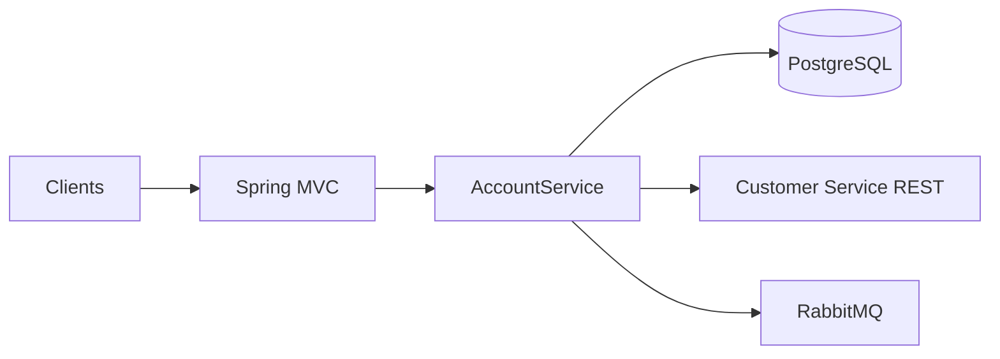

# Banking Account Service

This service owns the account aggregate: balances, lifecycle status, soft deletes, and internal ledger operations for the banking platform.

## Prerequisites

- Java 21 and Maven 3.9+
- PostgreSQL 16 with database `account_db`
- RabbitMQ 3.12+ (for domain events)
- Customer Service reachable at the configured base URL (for KYC verification on account creation)

## Quick start

1. Create the database and role (example):

```bash
psql -U postgres -c "CREATE DATABASE account_db;"
psql -U postgres -c "CREATE USER account_user WITH PASSWORD 'account_pass';"
psql -U postgres -c "GRANT ALL PRIVILEGES ON DATABASE account_db TO account_user;"
```

2. Copy environment template and adjust values:

```bash
cp .env.example .env
```

3. Export variables (or use your shell profile):

```bash
set -a && source .env && set +a
```

4. Run the application:

```bash
mvn spring-boot:run
```

5. Open API docs at `http://localhost:8002/swagger-ui.html`, health at `http://localhost:8002/health`, Prometheus scrape endpoint at `http://localhost:8002/metrics`.

6. Build with tests and coverage report:

```bash
mvn verify
```

Coverage report: `target/site/jacoco/index.html`.

## Configuration

- All credentials and connection targets are read from the environment (see `.env.example`). Defaults in `application.yml` match local development only.
- Docker-oriented overrides live in `application-docker.yml` (activate with `SPRING_PROFILES_ACTIVE=docker`).

## API overview

| Method | Path | Purpose |
|--------|------|---------|
| POST | `/api/v1/accounts` | Create account (KYC verified via Customer Service) |
| GET | `/api/v1/accounts` | Paginated list (`limit`, `offset`) |
| GET | `/api/v1/accounts/{id}` | Account details |
| GET | `/api/v1/accounts/{id}/balance` | Balance |
| PATCH | `/api/v1/accounts/{id}/status` | Status change (emits `account.status.changed`) |
| DELETE | `/api/v1/accounts/{id}` | Soft close |
| GET | `/api/v1/customers/{customerId}/accounts` | Accounts for customer (paginated) |
| POST | `/internal/accounts/{id}/validate` | Internal validation (active + optional minimum balance) |
| POST | `/internal/accounts/{id}/debit` | Internal debit |
| POST | `/internal/accounts/{id}/credit` | Internal credit |
| GET | `/health` | Actuator health (management base path `/`) |
| GET | `/metrics` | Prometheus registry |

List responses use `{"accounts":[],"total":0,"limit":20,"offset":0}`.

## Architecture



Layers: presentation (controllers, RFC 7807 errors), application (use cases, DTOs), domain (entities, enums), infrastructure (JPA, Flyway, RestClient, RabbitMQ, logging).

Flyway applies schema and seed data (`V3__seed_data.sql`) derived from `bank_Dataset/bank_accounts.csv` using deterministic UUIDv5 identifiers for stable references.

## Container image

```bash
docker build -t banking-account-service:1.0.0 .
```

Runtime expects the same environment variables as `.env.example`. The image runs as a non-root user and exposes port 8002.

## Kubernetes

Example manifests are under `k8s/`. Replace image name, secrets, and JDBC URL with values that match your cluster before applying.

## Common issues

- **Flyway validation errors:** Ensure PostgreSQL is reachable and `spring.jpa.hibernate.ddl-auto` stays `validate` for non-test runs.
- **Account creation fails KYC:** Customer Service must expose `GET /api/v1/customers/{id}/kyc` returning `kycStatus` (or `kyc_status`) `VERIFIED`.
- **RabbitMQ connection refused:** Check `RABBITMQ_HOST` and credentials; the app will fail to start if the broker is required and unreachable (adjust autoconfiguration if you run without RabbitMQ).
